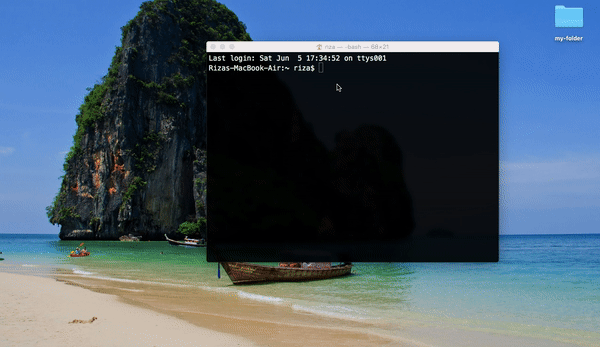

# Quick Start for Beginners

- Make sure you have installed NodeJS in your computer. If you don't have one, you can [install NodeJS here](https://nodejs.org/en/) and follow through the installation steps there.

- Open this directory in the Terminal or Command Prompt. (Alternatively you can open this folder project in VSCode and use the integrated terminal there).

  

- Run this command in the terminal:

  ```
  npm install
  ```

  > After that, your terminal will download for all the packages that is required for this project. Don't worry it will just **install them locally** in this folder project _(the size would be about 10MB)_. <br><br>
  > Actually this command is safe to run, because even if you have already installed the packages and still run this command, the packages won't be installed anymore.

- After that, Run this command in the terminal:

  ```
  npm start
  ```

  > This command is to start our application. <br> > **important: don't quit the terminal after run this command** <br><br>
  > Becase what it basically does is to starts local server so you can visit **localhost:3000** in the browser (see the next step).

- Finally, open browser and type this in URL bar

  ```
  localhost:3000
  ```

- Once you're finished, you can just quit the terminal. If you want to start the application again, you should **run the "npm start"** and **open localhost:3000** again.
